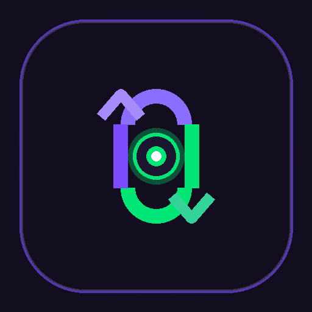
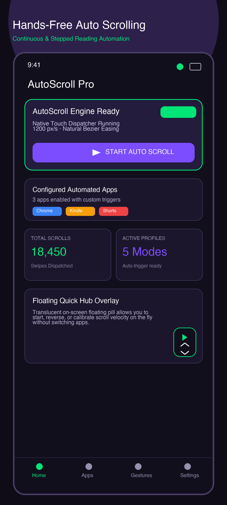
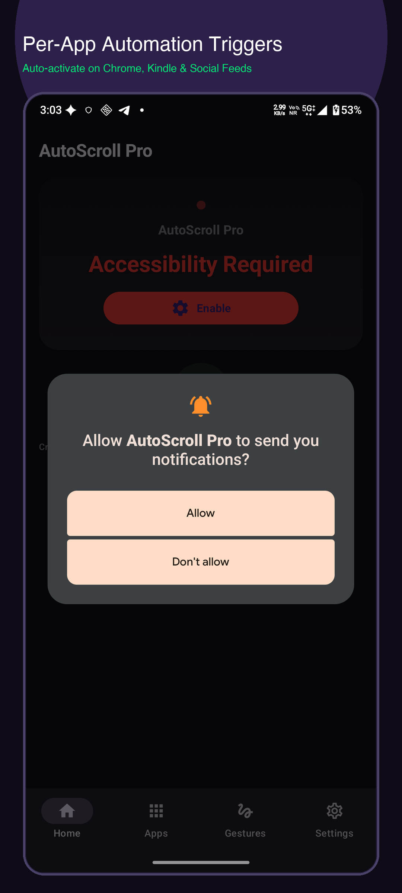
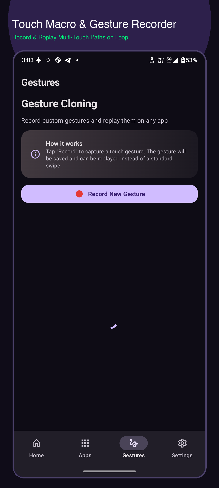
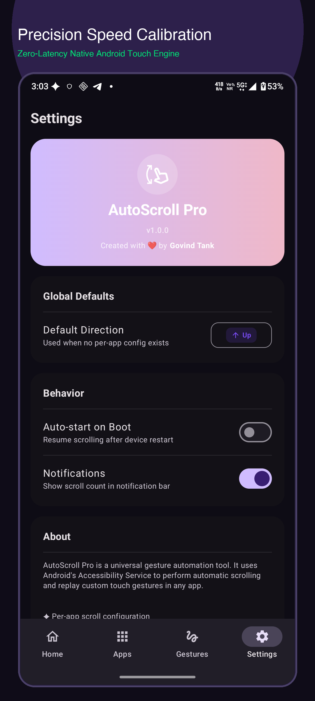

# AutoScroll Pro — Smart Hands-Free Scrolling

  

  <b>Effortless, hands-free automated scrolling & gesture touch macros for Android.</b> 
  Built with Jetpack Compose Material 3 & Native Android Accessibility Service.

---

## 📱 Google Play Compliance & Video Verification

- **Accessibility Service Video Disclosure Link**:  
  *(Playable directly in browser/media player)*
- **Live Privacy Policy**:  
  👉 **https://govindtank.github.io/autoscroll/**

---

## 🔒 Android AccessibilityService API Prominent Disclosure

AutoScroll Pro utilizes Android's `AccessibilityService` API strictly to deliver its core functionality:
1. **Automated Touch Gestures**: Dispatches simulated swipe up, swipe down, and page-turn touch events on your screen per user-configured speeds.
2. **Foreground App Detection**: Detects when designated applications (e.g., Google Chrome, Amazon Kindle, YouTube Shorts) open to automatically display floating quick controls.

### Strict Privacy Guarantee:
- **NO Personal Data Collected**: The app NEVER reads, intercepts, monitors, logs, or transmits any screen content, typed text, passwords, credit card numbers, or messages.
- **100% Offline & Local-First**: Operates purely as a local touch dispatcher with zero third-party analytics or tracking SDKs.

---

## 📸 Production Screenshots

  
  
  
  

---

## 🚀 Key Features

- **Continuous & Stepped Scroll Velocity**: Smooth customizable speeds with Bezier deceleration easing.
- **Per-App Trigger Profiles**: Automatic trigger rules when target apps launch.
- **Custom Gesture Macro Recorder**: Record multi-touch paths and loop playback.
- **Floating Quick-Control Overlay**: Translucent HUD to pause, reverse, or calibrate scrolling without switching apps.
- **OLED Dark Mode & Battery Friendly**: Zero idle CPU usage when paused.

---

## 📄 License & Author

Developed by **Govind Tank** ([@govindtank](https://github.com/govindtank))  
Contact: `govindtank600@gmail.com`
